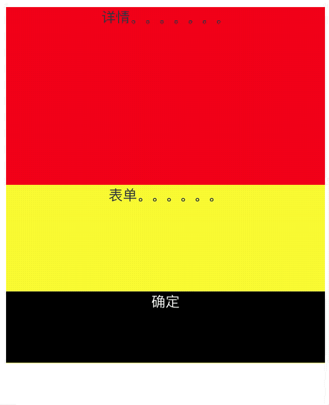

# 吸底布局

### 关于吸底布局需要注意的几个点：

- 绝对定位的元素的 bottom 是相对于其第一个非 static 父级元素包含块的外边界来偏移。

一个 设置了 overflow: auto 的非 static 元素,其内部包含的内容超过其设置的高度时（超过了外边界），相对于该元素底部定位的 absoulte 定位元素是一直停在这个高度位置。

尽管绝对定位的元素脱离了文档流，但是仍然是包含在父元素中。当滚动父元素内容时，这个绝对定位元素也会随着内容滚动。

```vue
<template>
  <div class="invoice-index">
    <div class="invoice-content">
      <div class="invoice-detail">
        详情。。。。。。。
      </div>
      <div class="invoice-form">
        <div class="content">
          表单。。。。。。
        </div>
        <div class="content">
          表单。。。。。。
        </div>
        <div class="content">
          表单。。。。。。
        </div>
        <div class="button">确定</div>
      </div>
    </div>
  </div>
</template>

<script>
export default {
  beforeRouteEnter(to, from, next) {
    next()
  }
}
</script>

<style scoped>
.invoice-index {
  position: relative;
  height: 400px;
  /* padding-bottom: 200px; */
  /* overflow: auto; */
}

.invoice-content {
  position: relative;
  height: 100%;
  overflow: auto;
}

.content {
  height: 900px;
  background: #ff0;
  width: 100%;
}

.content:nth-child(2) {
  height: 900px;
  background: #f00;
  width: 100%;
}

.invoice-detail {
  height: 200px;
  width: 100%;
  background: #f00;
}

.button {
  width: 100%;
  position: absolute;
  bottom: 0;
  left: 0;
  height: 80px;
  background: #000;
  color: #fff;
}
</style>
```



- 子元素高度设置 100%，高度值为父元素高度减去 padding-top/padding-bottom 的值。

### 吸底布局在 ios 和 android 上需要注意的点

```vue
<style scoped>
.invoice-index {
  position: relative;
  height: 100vh;
  /* height: 400px; */
  padding-bottom: 100px;
}

.invoice-content {
  /* position: relative; */
  height: 100%;
  /* box-sizing: border-box; */
  /* padding-bottom: 100px; */
  overflow: auto;
}

.content {
  height: 900px;
  background: #ff0;
  width: 100%;
}

.content:nth-child(2) {
  height: 900px;
  background: #f00;
  width: 100%;
}

.invoice-detail {
  height: 200px;
  width: 100%;
  background: #f00;
}

.button {
  width: 100%;
  position: absolute;
  bottom: 0;
  left: 0;
  height: 80px;
  background: #000;
  color: #fff;
}
</style>
```

- 底部元素 fixed 布局，全局滚动条滚到底部再向上滚动时会隐藏底部元素。
- 底部 fixed 布局的元素，键盘弹起 ios 上不会弹起该元素，但是 android 上会弹起。

ios 上如果有键盘弹起，收缩键盘时页面内容滚动条位置会被改变。可以通过监听失去焦点事情来手动改变滚动条的位置：

```
 async mounted() {
   document.body.addEventListener('focusout', this.handlerScrollTop);
 }

 beforeDestroy() {
   document.body.removeEventListener('focusout', this.handlerScrollTop);
 }

 //ios软键盘收起的事件处理
 handlerScrollTop(e: any) {
   if (window.navigator['userAgent'].indexOf('iPhone') > -1) {
     document.body['scrollTop'] = document.body.scrollTop;
   }
 }
```

android 上会弹起底部元素，可能会遮挡住输入框区域：

### 吸底布局的布局思路

固定在底部的元素相对于内容元素的父元素设置绝对定位或固定定位。

- 按钮固定在底部
- 内容在局部元素中滚动
